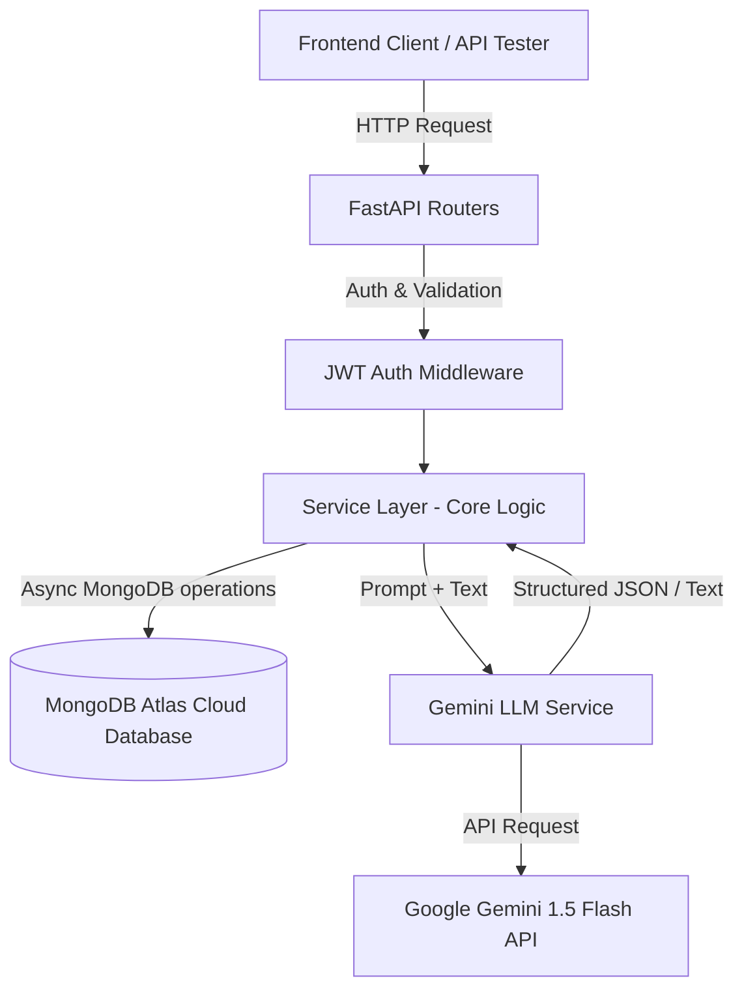

# System Architecture & Technical Design - WalletWiz

This document details the system design, database models, and LLM integration patterns for the WalletWiz backend.

---

## 1. System Architecture

The backend follows a clean, layered architecture:
1. **API Layer (Controller/Router)**: FastAPI routers for handling HTTP requests, parsing parameters, authentication, and validation.
2. **Service Layer**: Contains core business logic (transaction management, queries logic, Gemini integration).
3. **AI/LLM Integration Service**: Communicates with the Google Gen AI API (Gemini 1.5 Flash), managing system prompts and structured schema configurations.
4. **Data Access Layer**: Interacts with **MongoDB Atlas** via `Beanie` (an ODM for MongoDB based on Pydantic).



#### 1.1. Code Directory Layout
Following a clean, modular structure modeled after our other production projects, the application's source code inside `app/` is organized as follows:

```text
app/
├── api/
│   ├── v1/
│   │   ├── auth.py             # User Register, Login, Google OAuth
│   │   ├── transactions.py     # CRUD + LLM-parse endpoint
│   │   ├── query.py            # Conversational QA endpoint (/query)
│   │   └── analytics.py        # Dashboard & charts aggregation
│   └── dependencies.py         # JWT Verification dependency (get_current_user)
├── core/
│   ├── config.py               # Pydantic Settings (.env loader)
│   ├── database.py             # Beanie ODM & MongoDB Atlas connection
│   ├── security.py             # Password hashing & JWT token generators
│   └── exceptions.py           # Custom exception models & handlers
├── models/
│   ├── db_user.py              # User collection Beanie document
│   ├── db_transaction.py       # Transaction collection Beanie document
│   ├── request.py              # Pydantic schemas for API inputs (Register, CreateTransaction, etc.)
│   └── response.py             # Pydantic schemas for API outputs (ParsedExpense, DashboardData, etc.)
├── scripts/
│   └── seed_mock_data.py       # Seed mock transactions for testing
├── services/
│   ├── auth.py                 # Registration & authentication workflow logic
│   ├── transaction.py          # CRUD transactions, logic filters & DB writes
│   ├── analytics.py            # MongoDB aggregation pipelines for charts
│   ├── llm_provider.py         # Gemini API client instantiation & Langsmith setups
│   ├── prompt_builder.py       # System instructions and prompt templates
├── api/
│   ├── v1/
│   │   ├── auth.py             # User Register, Login, Google OAuth
│   │   ├── transactions.py     # CRUD + LLM-parse endpoint
│   │   ├── query.py            # Conversational QA endpoint (/query)
│   │   └── analytics.py        # Dashboard & charts aggregation
│   └── dependencies.py         # JWT Verification dependency (get_current_user)
├── core/
│   ├── config.py               # Pydantic Settings (.env loader)
│   ├── database.py             # Beanie ODM & MongoDB Atlas connection
│   ├── security.py             # Password hashing & JWT token generators
│   └── exceptions.py           # Custom exception models & handlers
├── models/
│   ├── db_user.py              # User collection Beanie document
│   ├── db_transaction.py       # Transaction collection Beanie document
│   ├── request.py              # Pydantic schemas for API inputs (Register, CreateTransaction, etc.)
│   └── response.py             # Pydantic schemas for API outputs (ParsedExpense, DashboardData, etc.)
├── scripts/
│   └── seed_mock_data.py       # Seed mock transactions for testing
├── services/
│   ├── auth.py                 # Registration & authentication workflow logic
│   ├── transaction.py          # CRUD transactions, logic filters & DB writes
│   ├── analytics.py            # MongoDB aggregation pipelines for charts
│   ├── llm_provider.py         # Gemini API client instantiation & Langsmith setups
│   ├── prompt_builder.py       # System instructions and prompt templates
│   └── query_processor.py      # Natural language query filters & conversation context builders
├── tests/                      # Unit and integration test suites
├── utils/
│   ├── logger.py               # Structured log formatting
│   └── datetime_helpers.py     # Resolving relative dates (e.g. "yesterday") for the LLM reference
├── .example.env
├── main.py                     # Entrypoint (Instantiates FastAPI, DB connection, registers routers)
└── requirements.txt
```

---


## 2. Database Design (MongoDB Collection Models)

Since we are using **MongoDB**, we will store data as BSON documents. Using MongoDB allows flexible metadata from the LLM to be stored without requiring schema migrations.

### 2.1. `users` Collection
Stores registered user credentials.
```json
{
  "_id": "ObjectId",
  "email": "string (unique index)",
  "password_hash": "string (optional, required if provider is email)",
  "first_name": "string",
  "auth_provider": "string (email | google)",
  "google_id": "string (optional, unique index if provided)",
  "created_at": "date"
}
```

### 2.2. `transactions` Collection
Stores transactions logged manually or generated via LLM.
```json
{
  "_id": "ObjectId",
  "user_id": "ObjectId (index)",
  "amount": "double",
  "category": "string (index)",
  "payment_method": "string (index, Cash | Card | UPI)",
  "merchant": "string",
  "description": "string",
  "transaction_date": "date (index)",
  "source_type": "string (manual | llm)",
  "llm_metadata": {
    "confidence_score": "double",
    "raw_input_text": "string"
  },
  "created_at": "date"
}
```
*Note: Predefined categories are: `Food & Dining`, `Shopping`, `Travel & Transport`, `Bills & Utilities`, `Entertainment`, `Health & Medical`, `Others`.*
*Note: Predefined payment methods are: `Cash`, `Card`, `UPI`.*

---

## 3. Agentic LLM & Tool Integration Strategy

We will use **LangChain** to orchestrate our LLM interactions as a unified Conversational Agent with tools, and **LangSmith** for tracing, debugging, and token metrics tracking.

### 3.1. Stateless Conversation Memory
The agent maintains memory for multi-turn chats (including follow-up queries) but remains stateless on the server:
1. The client maintains the conversation log in its local UI state.
2. Every request to `POST /api/v1/chat` passes the recent history of messages along with the new user message.
3. The backend dynamically feeds this history into the agent executor's memory buffer before invoking the model.

### 3.2. Agent Tools Definition
The agent is equipped with two custom Python tools:
* **Tool `log_transaction`**: Called when the user intent is to record an expense.
  - *Parameters*:
    - `amount`: float (required)
    - `category`: string (required; must match predefined categories)
    - `payment_method`: string (optional; Cash, Card, UPI)
    - `merchant`: string (optional)
    - `transaction_date`: string (optional ISO 8601 date-time)
    - `description`: string (optional)
* **Tool `query_database`**: Called when the user asks a question about their transactions.
  - *Parameters*:
    - `category`: string (optional)
    - `payment_method`: string (optional)
    - `merchant`: string (optional)
    - `start_date`: string (optional ISO date)
    - `end_date`: string (optional ISO date)
    - `min_amount`: float (optional)
    - `max_amount`: float (optional)

### 3.3. Security & Context Isolation (User-ID Pre-binding)
To prevent prompt injections and data leaks:
* The tools are instantiated dynamically on each request.
* We pre-bind the authenticated `user_id` (extracted from the JWT token) directly into the tool functions.
* The agent has no access to the user ID and cannot query or write data outside the active user's scope.

---

## 4. Key Agent Workflows

### 4.1. Unified Agent Execution Loop
The entire chat transaction follows a single unified loop:

1. **Client Request**: Client calls `POST /api/v1/chat` with `{ "message": "...", "history": [...] }` sending JWT in auth header.
2. **Setup**: Backend verifies JWT, extracts `user_id`, binds `user_id` to `log_transaction` and `query_database` tools, and loads the `history` into the LangChain memory manager.
3. **Reasoning Step**: Agent reads the input. It decides if a tool is needed:
   * **If Tool Selected**: Executes tool -> receives result/error -> goes back to reasoning.
   * **If No Tool Selected**: Proceeds to final answer generation.
4. **Tool Execution (e.g. logging/querying)**: Executes database updates or fetch operations in MongoDB Atlas.
5. **Final Answer Synthesis**: Agent constructs a natural language response (incorporating tool results or asking for missing parameters) and returns it.

---

## 5. Technical Design Decisions

### 5.1. Rate Limiting & Protection
* **Endpoints Affected**: `/transactions/llm-parse` and `/query`
* **Rule**: Limit users to **20 requests per minute** (RPM) using a FastAPI rate limiter (e.g., `slowapi`). This protects the backend from unexpected API credit depletion and safeguards Gemini API quotas.

### 5.2. Google OAuth & Account Linking
* **Rule**: Auto-linking is enabled.
* **Flow**: When a user logs in via Google OAuth (`POST /auth/google`), the backend checks if the verified email already exists in the database.
  * If the email exists, the account is linked automatically (updating the user document to record their `google_id` and setting `auth_provider` to `google` or keeping both), allowing the user access to their existing transaction history.
  * If the email does not exist, a new user account is created.

### 5.3. LLM Parsing Fallbacks & Error Handling
* **Rule**: Graceful degradation.
* **Flow**: If Gemini fails to parse the natural language input (e.g., the input is gibberish or contains no transaction details):
  * The LLM service will return the Pydantic schema with best-guess fields set to `null` and a `confidence_score` below `0.5`.
  * The frontend will intercept this and display the manual entry form with whatever fields could be salvaged, rather than showing an error or crashing.
